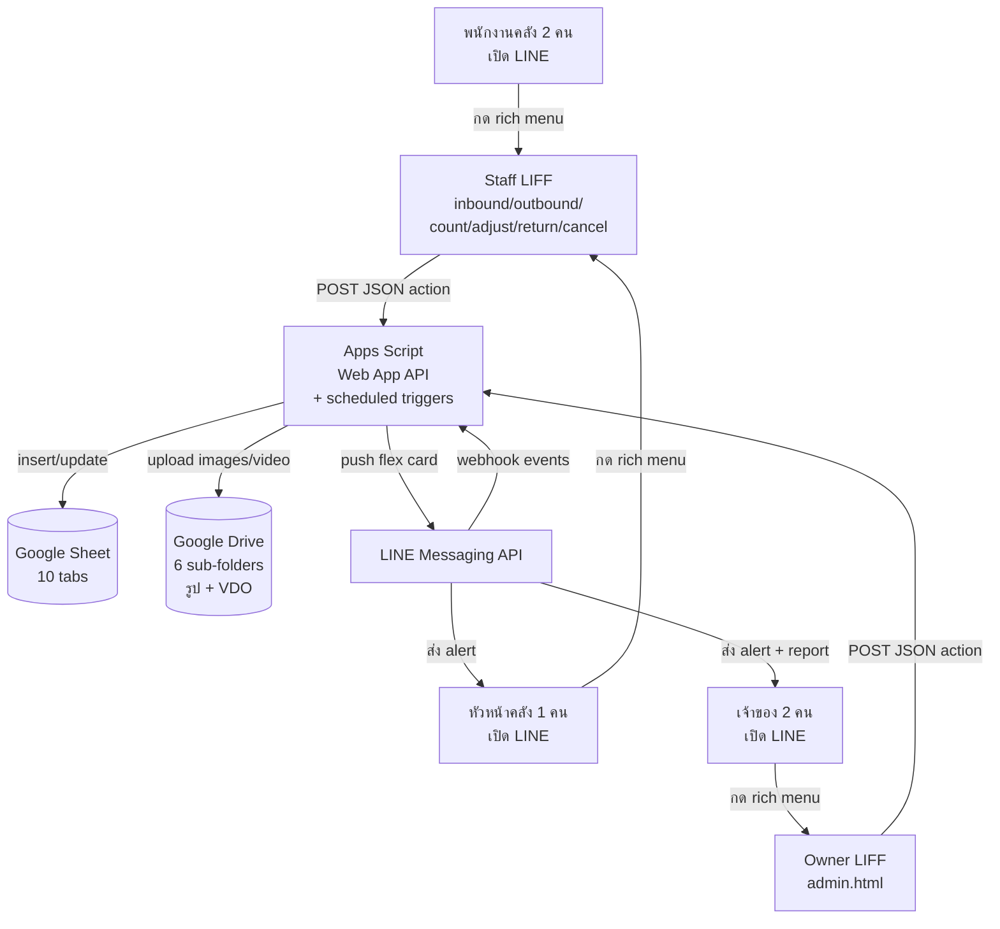

# Architecture — Vorda Warehouse

> **อ่านก่อน:** [../CONTEXT.md](../CONTEXT.md) + [../CLAUDE.md](../CLAUDE.md)

---

## 1. ภาพรวมระบบ

**Legend:**
- 🟦 LIFF (frontend) บน GitHub Pages
- 🟩 Apps Script (backend + scheduler)
- 🟨 Google Sheet (database 10 tabs)
- 🟧 Google Drive (รูป 4 มุม + VDO ตีคืน + screenshot เคลม)
- 🟦 LINE Messaging API (alert + report + webhook)

---

## 2. Data Flow — 6 flow หลัก

### Flow A: รับเข้าจากโรงงาน (inbound) — double-blind

| # | Step | ใครทำ | ข้อมูล | ปลายทาง |
|---|---|---|---|---|
| 1 | กดเมนู "รับเข้า" | คนนับ 1 | — | LIFF inbound |
| 2 | เลือกสินค้า + กรอก qty + ถ่ายรูป 4 มุม | คนนับ 1 | productId, qty, photos[4] | LIFF |
| 3 | submit (ไม่ใส่ pairingMovementId) | LIFF | action=submitInbound | Apps Script |
| 4 | upload รูป Drive + insert Movements (status=pending_partner) | Apps Script | photo_urls, submitter1_* | Sheet + Drive |
| 5 | return movement_id ให้คนที่ 1 บอกเพื่อน | Apps Script | { movementId } | LIFF |
| 6 | คนที่ 2 เปิดเมนู + ใส่ MOV-... | คนนับ 2 | pairingMovementId, qty, photos[4] | LIFF |
| 7 | submit | LIFF | action=submitInbound | Apps Script |
| 8 | match qty | Apps Script | — | — |
| 9a | ถ้าตรง → status=confirmed + apply Stock + push manager | Apps Script | qty_on_hand += qty | Sheet + LINE |
| 9b | ถ้าไม่ตรง → status=pending_supervisor + push หัวหน้า | Apps Script | flex card | LINE |
| 10 | (ถ้า 9b) หัวหน้าเปิด LIFF + ตัดสิน | หัวหน้า | supervisor_qty, photos[4] | LIFF → Apps Script (submitSupervisorTiebreaker) |
| 11 | apply Stock (qty=supervisor_qty) | Apps Script | — | Sheet + LINE |

### Flow B: หยิบออกไปแพค (outbound)
- เหมือน Flow A แต่ apply Stock เป็นลบ (qty_on_hand -= qty)
- ก่อน apply ตรวจ qty_on_hand >= qty — ถ้าไม่พอ reject + push manager

### Flow C: นับเทียบ (count) — สัปดาห์ละครั้ง

| # | Step | ใครทำ | ข้อมูล | ปลายทาง |
|---|---|---|---|---|
| 1-7 | เหมือน Flow A | | | |
| 8 | match qty | | | |
| 9a | ตรง: คำนวณ variance = final_qty − system_qty | Apps Script | — | — |
| 9b | variance === 0 → status=no_action | Apps Script | — | Sheet + LINE manager (info) |
| 9c | variance ≠ 0 → status=awaiting_owner | Apps Script | — | Sheet + LINE owner (alert) |
| 10 | (ถ้า 9c) owner เปิด admin LIFF + กด "ปรับยอด" | owner | countId, deltaQty=variance, reason | LIFF |
| 11 | adjustStock → insert Movement (adjust) → apply Stock | Apps Script | — | Sheet |
| 12 | update count: status=resolved_by_adjust | Apps Script | — | Sheet |

### Flow D: ตัดสต๊อก (adjust) — ของเสีย/แตก
- เหมือน Flow A แต่:
  - field `reason` บังคับ (เหตุผลที่ตัด)
  - apply Stock เป็นลบ (qty_on_hand -= qty)
  - movement_type='adjust'

### Flow E: ตีคืนสินค้า (return) — ซับซ้อนสุด

| # | Step | ใครทำ | ข้อมูล | ปลายทาง |
|---|---|---|---|---|
| 1 | ลูกค้าส่งของกลับ | — | — | (offline) |
| 2 | พนักงานเปิด LIFF return + แกะของถ่าย VDO | staff | tracking, productId?, qty, isOurProduct, condition, video, photos | LIFF |
| 3 | submit | LIFF | action=submitReturn | Apps Script |
| 4 | upload VDO + รูป → insert Returns (status=pending_owner) | Apps Script | — | Sheet + Drive |
| 5 | push owner flex card (มี VDO + ปุ่ม) | Apps Script | — | LINE owner |
| 6 | owner เปิด admin LIFF | owner | — | LIFF |
| 7a | decision=accept_to_stock (good + ของเรา) | owner → Apps Script | returnId | LIFF → API |
|   | → insert Movement (return_in, +qty) → apply Stock → status=accepted | Apps Script | — | Sheet |
| 7b | decision=reject_bad (ของเรา + bad) | owner | — | — |
|   | → status=rejected (ไม่กระทบ Stock) | Apps Script | — | Sheet |
| 7c | decision=forward_to_claim (ไม่ใช่ของเรา) | owner | — | — |
|   | → สร้าง Claim (stage=submitting) → Returns.status=forwarded_to_claim | Apps Script | claim_id | Sheet |
| 8 | (ถ้า 7c) owner update claim 3 ขั้น | owner → Apps Script | claimId, newStage, screenshot | LIFF → API |
|   | submitting → submitted (screenshot_submitted) | | | |
|   | submitted → closed (screenshot_closed + closed_result) | | | |

### Flow F: ยกเลิกออเดอร์ (cancel) — ของไม่ถึงปลายทาง

| # | Step | ใครทำ | ข้อมูล | ปลายทาง |
|---|---|---|---|---|
| 1 | ของส่งกลับเพราะลูกค้ายกเลิก | — | — | (offline) |
| 2 | พนักงานบันทึก: tracking + product + qty + รูป | staff | — | LIFF cancel |
| 3 | submit | LIFF | action=submitCancel | Apps Script |
| 4 | insert Cancellations (status=pending_owner) → push owner | Apps Script | — | Sheet + LINE |
| 5 | owner กด accept/reject ใน admin LIFF | owner | cancelId, decision | LIFF → API |
| 6a | accept → insert Movement (cancel_in, +qty) → apply Stock → status=accepted | Apps Script | — | Sheet |
| 6b | reject → status=rejected | Apps Script | — | Sheet |

---

## 3. Sheet Structure

ดู [../CONTEXT.md § 4 Data Model](../CONTEXT.md#4-data-model) — มี 10 sheets:
- `Products` — master 5 SKU
- `Stock` — ยอดคงเหลือปัจจุบัน
- `Movements` — ทุก movement
- `Counts` — นับเทียบสัปดาห์ละครั้ง
- `Returns` — ตีคืนสินค้า
- `Cancellations` — ยกเลิกออเดอร์
- `Claims` — flow เคลม 3 ขั้น
- `Staff` — รายชื่อคนใช้ระบบ
- `Logs` — error + audit
- `Config` — ค่าตั้งระบบ

---

## 4. Setup Plan

ดู [../TASKS.md](../TASKS.md) — TASK-01 ถึง TASK-06 = setup ก่อนเริ่มเขียน flow

สรุปสั้น:
- [ ] Step 1: รัน `Setup.gs::setupAll()` ใน Apps Script
- [ ] Step 2: แก้ชื่อสินค้า + ยอดเริ่มต้น 5 SKU ใน Sheet `Products` + `Stock`
- [ ] Step 3: สร้าง LINE Messaging API channel + 7 LIFF apps
- [ ] Step 4: ใส่ secrets + LIFF_IDs ใน Script Properties
- [ ] Step 5: เก็บ LINE userId ของ owner + supervisor → ใส่ใน Sheet Config
- [ ] Step 6: clasp push backend
- [ ] Step 7: implement TASK-08 ถึง TASK-22 ตาม TASKS.md
- [ ] Step 8: implement TASK-23 ถึง TASK-30 (LIFF frontend)
- [ ] Step 9: Deploy Web App (Anyone) + LINE webhook + GitHub Pages
- [ ] Step 10: Update LIFF endpoint URLs + Rich menu
- [ ] Step 11: ทดสอบ end-to-end ในมือถือจริง
- [ ] Step 12: รัน `Report.gs::installTriggers()` 1 ครั้ง

---

## 5. Edge Cases

| สถานการณ์ | วิธีรับมือ | implement ที่ |
|---|---|---|
| คนกรอก submit ซ้ำ 2 ครั้งใน 5 วินาที | dedup ผ่าน `dedupRecentSubmission_` | ทุก handle*Submit* |
| คนนับ 2 ใส่ pairingMovementId ผิด (ไม่ตรง movement_type) | reject + return error 'invalid_pairing' | Inbound/Outbound/Adjust/Count |
| คนนับ 2 ใช้ pairingMovementId ของตัวเอง (รอบ 1) | reject + return error 'same_submitter' | เหมือนข้างบน |
| คนกดยกเลิก submission หลัง 5 นาที | reject + return error 'cancel_window_expired' | Submission.gs |
| คนกดยกเลิก submission ของคนอื่น | reject + return error 'not_owner_of_submission' | Submission.gs |
| Apps Script timeout 6 นาที (VDO ใหญ่) | จำกัด VDO 30 วินาที + low bitrate ใน LIFF | camera.js + return.html |
| LINE push fail | retry 3 ครั้ง exponential backoff | LineApi.gs |
| รูปใหญ่เกิน LIFF | resize maxWidth 1280 + quality 0.85 ก่อน base64 | utils.js |
| Drive URL render ไม่ออกใน flex card | แปลง `/file/d/.../view` → `https://drive.google.com/thumbnail?id=...&sz=w800` | DriveStore.gs::driveUrlToThumbnail_ |
| iOS file input bypass `capture` → เลือก gallery | ใช้ getUserMedia เท่านั้น (ห้าม `<input type=file>`) | camera.js |
| Sheet `08:00` กลายเป็น Date | format Date → 'HH:mm' string | Config.gs::readSheetConfig_ |
| Owner กด approve ซ้ำ (LINE flex postback ซ้ำ) | เช็ค status ก่อน update — ถ้าไม่ใช่ pending_owner → no-op | Return/Cancel handlers |
| Stock ติดลบ (หยิบออกเกิน) | reject ตอน outbound double-blind ตรงกัน + qty > qty_on_hand | Outbound.gs |
| 2 owner approve return คนละ flex card พร้อมกัน | LockService.tryGetLock 5 วินาที + เช็ค status ก่อน | Return.gs::handleApproveReturn |

---

## 6. Next Steps
- [ ] Implement ตาม TASKS.md ทีละ phase
- [ ] Update doc นี้เมื่อ architecture เปลี่ยน
- [ ] เพิ่ม diagram per flow ในอนาคต (ตอนนี้รวบใน mermaid เดียวพอ)
